╔══════════════════════════════════════════════════════════════╗
║        ROBOTIC ARM — GESTURE CONTROL  |  Setup Guide        ║
╚══════════════════════════════════════════════════════════════╝

FILES IN THIS FOLDER
──────────────────────────────────────────────────────────────
  control_panel.html          ← Open this in Chrome (via bridge)
  bridge.py                   ← Run this in terminal first
  arduino_sketch/
    robotic_arm.ino           ← Upload this to Arduino Uno
  README.txt                  ← This file

WHAT YOU NEED
──────────────────────────────────────────────────────────────
  Hardware:
    • Arduino Uno + USB cable
    • 4x servo motors
    • Breadboard + jumper wires
    • Laptop with webcam

  Software:
    • Arduino IDE         → https://www.arduino.cc/en/software
    • Python 3            → https://www.python.org/downloads
    • Google Chrome or Edge browser

WIRING DIAGRAM
──────────────────────────────────────────────────────────────

  Each servo has 3 wires:

    RED wire    →  Breadboard + rail  (power)
    BLACK/BROWN →  Breadboard - rail  (ground)
    ORANGE/YEL  →  Arduino signal pin (below)

  Servo assignments:
    BASE servo     signal → Arduino Pin 9
    SHOULDER servo signal → Arduino Pin 10
    ELBOW servo    signal → Arduino Pin 11
    GRIPPER servo  signal → Arduino Pin 6

  Power rails:
    Arduino 5V  → Breadboard + rail
    Arduino GND → Breadboard - rail

  Then plug Arduino into laptop via USB.

STEP 1 — Upload Arduino sketch
──────────────────────────────────────────────────────────────
  1. Open Arduino IDE
  2. Go to File → Open → select arduino_sketch/robotic_arm.ino
  3. Select your board: Tools → Board → Arduino Uno
  4. Select your port: Tools → Port → (pick the one with Arduino)
  5. Click Upload (→ arrow button)
  6. Open Serial Monitor (top right), set baud to 9600
  7. You should see: ARM READY
  8. Test it: type  B90 S90 E90 G0  and press Enter
     → All servos should move to home position ✓

STEP 2 — Install Python packages
──────────────────────────────────────────────────────────────
  Open terminal / command prompt and run:

    pip install pyserial websockets

  That's it — only 2 packages needed.

STEP 3 — Set your COM port in bridge.py
──────────────────────────────────────────────────────────────
  Open bridge.py in any text editor (Notepad is fine).
  Find this line near the top:

    SERIAL_PORT = "COM3"

  Change it to match your Arduino port:
    Windows  →  COM3, COM4, COM5 ... (check Arduino IDE → Tools → Port)
    Mac      →  /dev/tty.usbmodem101  or similar
    Linux    →  /dev/ttyUSB0  or  /dev/ttyACM0

  Save the file.

STEP 4 — Run the Python bridge
──────────────────────────────────────────────────────────────
  Open terminal / command prompt in this folder and run:

    python bridge.py

  You should see:
    [SERIAL] Connected on COM3  |  Arduino says: ARM READY
    [HTTP]   Serving files on http://localhost:8000
    [HTTP]   Open Chrome → http://localhost:8000/control_panel.html
    [WS]     WebSocket server on ws://localhost:8765

  Leave this terminal open — it must stay running.

STEP 5 — Open the control panel
──────────────────────────────────────────────────────────────
  Open Google Chrome and go to:

    http://localhost:8000/control_panel.html

  You should see:
    • "Arduino on" badge turns GREEN in top right
    • "Panel ready" message in Action Log

STEP 6 — Start gesture control
──────────────────────────────────────────────────────────────
  1. Click the green ▶ START button
  2. Allow camera access when Chrome asks
  3. Wait ~5 seconds for "Hand model loaded ✓" in the log
  4. Show your hand to the camera

  Hand controls:
    Move hand LEFT/RIGHT  →  Base servo rotates
    Move hand UP/DOWN     →  Shoulder moves
    Raise/lower finger    →  Elbow bends
    Curl all fingers      →  Gripper closes (FIST = fully closed)
    Open all fingers      →  Gripper opens

TROUBLESHOOTING
──────────────────────────────────────────────────────────────
  Problem: "Camera error" when clicking Start
  Fix: Make sure you opened via http://localhost:8000
       NOT by double-clicking the HTML file directly

  Problem: "Arduino off" badge stays red
  Fix: Check SERIAL_PORT in bridge.py matches your Arduino port
       Make sure bridge.py is running in terminal

  Problem: Hand detected but servos not moving
  Fix: Check "Arduino on" badge is green
       Check terminal for error messages

  Problem: Servos twitching or jittering
  Fix: Add a 100µF capacitor between 5V and GND on breadboard
       Or power servos from a separate 5V supply (not Arduino)

  Problem: Permission denied on serial port (Linux/Mac)
  Fix: Run:  sudo chmod 666 /dev/ttyUSB0
       (replace with your port name)

  Problem: No hand detected
  Fix: Make sure whole hand is visible in frame
       Good lighting helps — avoid backlighting
       Hand should be within 30-60cm of camera

SERIAL COMMAND FORMAT (for reference)
──────────────────────────────────────────────────────────────
  Commands are sent as plain text over USB serial:

    B{angle} S{angle} E{angle} G{angle}\n

  Examples:
    B90 S90 E90 G0     ← home position
    B45 S120 E80 G60   ← arm rotated left, shoulder up, gripper closed
    B135 S60 E40 G30   ← arm rotated right, shoulder down

  Angle ranges:
    Base     0–180°
    Shoulder 30–150°
    Elbow    0–160°
    Gripper  0–60°

